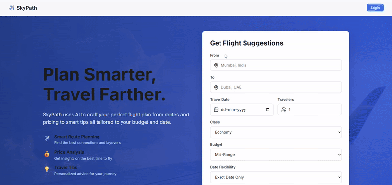

<div align="center">

**Happy Flying With SKYPATH! ✈️**



</div>

 ✈️ AI-Powered Flight Suggestion System

[](https://reactjs.org/)
[](https://nodejs.org/)
[](https://www.mongodb.com/)
[](https://ai.google.dev/)

An intelligent flight recommendation platform that leverages Google's Generative AI (Gemini) to provide personalized, context-aware flight suggestions based on user preferences, budget constraints, and travel requirements.

## 🌟 Features

### 🚀 AI-Powered Recommendations
- **Intelligent Flight Suggestions**: Uses Google Gemini AI to generate personalized flight options
- **Dynamic Pricing Analysis**: Considers budget constraints and market conditions
- **Flexible Travel Options**: Adapts to user preferences for class, dates, and flexibility

### 🔐 User Management
- **Secure Authentication**: JWT-based user registration and login
- **Session Management**: Cookie-based authentication for enhanced security

### 🗺️ Interactive Experience
- **Visual Flight Maps**: Integrated Leaflet maps for route visualization
- **Real-time Updates**: Dynamic flight information display
- **Responsive Design**: Optimized for desktop and mobile devices

### 📊 Smart Filtering
- **Multi-criteria Search**: Filter by origin, destination, dates, budget, and class
- **Travel Flexibility**: Options for flexible dates and preferences
- **Group Travel Support**: Accommodates multiple travelers

## 🛠️ Tech Stack

### Backend
- **Runtime**: Node.js with ES6 modules
- **Framework**: Express.js
- **Database**: MongoDB with Mongoose Atlas
- **Authentication**: JWT (JSON Web Tokens) + bcryptjs
- **AI Integration**: Google Generative AI (Gemini)
- **Security**: CORS, cookie-parser, input validation

### Frontend
- **Framework**: React 19 with Vite
- **Routing**: React Router DOM v7
- **HTTP Client**: Axios for API communication
- **Maps**: Leaflet with React-Leaflet
- **UI Components**: Custom components with CSS modules
- **Icons**: Lucide React
- **Notifications**: React Toastify

## 📋 Prerequisites

Before running this application, make sure you have the following installed:

- **Node.js** (v18.0 or higher)
- **MongoDB** (local installation or cloud instance like MongoDB Atlas)
- **Google Gemini API Key** (from [Google AI Studio](https://makersuite.google.com/app/apikey))

## 🚀 Getting Started

### 1. Clone the Repository

```bash
git https://github.com/ansarimohammad/SkyPath-GenAI-Flight-Suggestions.git
cd flight-suggestion-app
```

### 2. Backend Setup

```bash
# Navigate to backend directory
cd Backend

# Install dependencies
npm install

# Create environment file
cp .env.example .env
```

Edit the `.env` file with your configuration:

```env
PORT=3000
MONGODB_URI=mongodb://localhost:27017/flight-app
JWT_SECRET=your-super-secret-jwt-key
GEMINI_API_KEY=your-google-gemini-api-key
FRONTEND_URL=http://localhost:5173
```

**Note**: Replace the placeholder values with your actual:
- MongoDB connection string
- Secure JWT secret key
- Google Gemini API key from [Google AI Studio](https://makersuite.google.com/app/apikey)

### 3. Frontend Setup

```bash
# Navigate to frontend directory
cd ../Frontend

# Install dependencies
npm install
```

### 4. Start the Application

#### Option A: Run Both Services Separately

**Terminal 1 - Backend:**
```bash
cd Backend
npm run dev
```
The backend server will start on `http://localhost:3000`

**Terminal 2 - Frontend:**
```bash
cd Frontend
npm run dev
```
The frontend application will start on `http://localhost:5173`

#### Option B: Using Concurrently (Recommended for Development)

If you prefer to run both services with a single command, you can add `concurrently` to the root package.json and create a dev script.

### 5. Access the Application

Open your browser and navigate to `http://localhost:5173` to start using the flight suggestion system!

### Request Example
```json
{
  "origin": "New York (JFK)",
  "destination": "London (LHR)",
  "travelDate": "2024-12-25",
  "budget": "$2000",
  "flightClass": "Economy",
  "travelers": "2",
  "flexibility": "Flexible"
}
```

## 🎯 Usage

1. **Sign Up/Login**: Create an account or log in to access personalized features
2. **Enter Travel Details**: Specify origin, destination, dates, budget, and preferences
3. **Get AI Suggestions**: Receive intelligent flight recommendations powered by Gemini AI
4. **View on Map**: Visualize flight routes and airport locations
5. **Book or Save**: Save favorite options or proceed to booking


